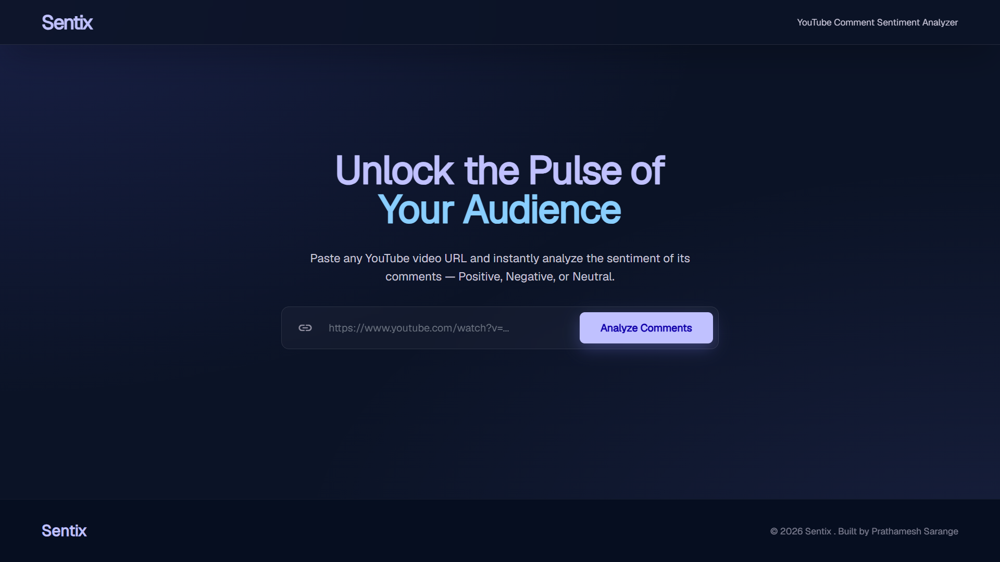
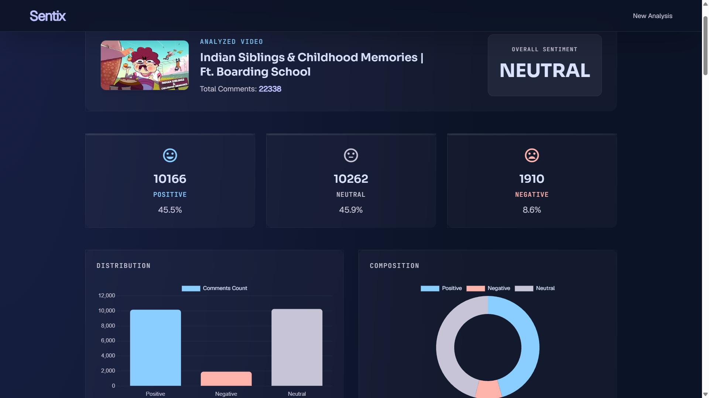

# 🎥 Sentix | YouTube Sentiment Analyzer


Sentix is a web application that analyzes the sentiment of comments on any YouTube video. By simply pasting a YouTube video link, this tool fetches the comments, processes them using Natural Language Processing (NLP), and categorizes the general public reaction as Positive, Negative, or Neutral.

## ✨ Features

- **Instant Analysis:** Enter any YouTube URL to get immediate sentiment insights.
- **Detailed Metrics:** View total comments analyzed, along with percentages and counts for Positive, Negative, and Neutral sentiments.
- **Top Comments Highlights:** Displays the most significantly positive and negative comments.
- **Data Export:** Download the complete sentiment analysis results as a CSV file for further use.
- **Data Visualization:** Includes a standalone Python script (`scraper.py`) that generates a bar chart of the sentiment distribution using Matplotlib.

## 🛠️ Technologies Used

- **Backend:** Python, Flask
- **Frontend:** HTML, TailwindCSS (via CDN)
- **APIs & Libraries:**
  - `google-api-python-client` (YouTube Data API v3)
  - `vaderSentiment` (Lexicon and rule-based sentiment analysis)
  - `python-dotenv` (Environment variable management)
  - `matplotlib` (For data visualization in the standalone scraper)

## 🚀 Getting Started

### Prerequisites

Ensure you have Python installed on your system. You will also need a Google Cloud project with the YouTube Data API v3 enabled to get an API key.

### Installation

1. **Clone the repository:**
   ```bash
   git clone <git clone https://github.com/prathameshsarange/Youtube-Sentiment-Analyzer.git>
   cd "youtube sentiment analyzer"
   ```

2. **Install required dependencies:**
   It is recommended to use a virtual environment.
   ```bash
   pip install -r requirements.txt
   ```

3. **Configure the API Key:**
   - Create a `.env` file in the project's root directory.
   - Add your YouTube Data API v3 Key:
     ```env
     YOUTUBE_API_KEY=your_api_key_here
     ```

### Running the Web Application

1. Start the Flask server:
   ```bash
   python app.py
   ```
2. Open your web browser and navigate to `http://127.0.0.1:5000/`.
3. Paste a YouTube video URL into the input field and click Analyze!

### Running the Standalone Scraper

If you prefer to run the script locally and view a visual chart:
1. Edit `scraper.py` and change the `VIDEO_URL` variable to your desired video.
2. Run the script:
   ```bash
   python scraper.py
   ```

## 📁 Project Structure

```text
├── app.py             # Main Flask web application
├── scraper.py         # Standalone script for terminal analysis & charting
├── requirements.txt   # Python dependencies
├── .env               # Environment variables (API Key)
├── templates/
│   ├── index.html     # Homepage with the URL input form (Tailwind styling)
│   └── result.html    # Results display dashboard
└── README.md          # Project documentation
```
## 📸 Screenshots

### Home Page


### Sentiment Analysis Result


## 🤝 Contributing

Contributions, issues, and feature requests are welcome!

## 📝 License

This project is open-source and available under the [MIT License](LICENSE).
